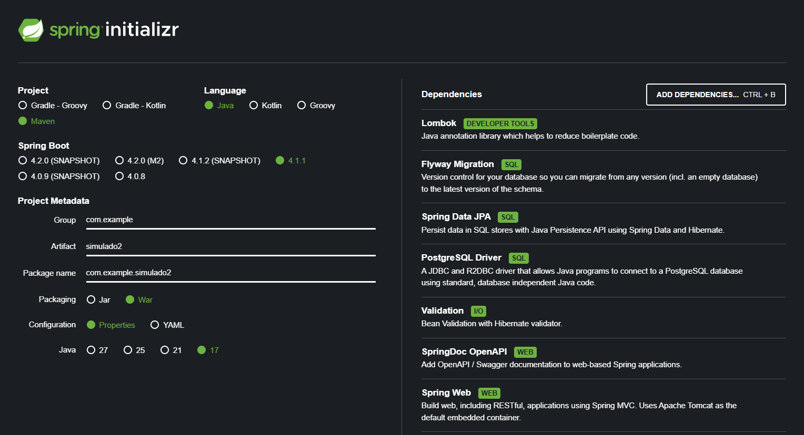
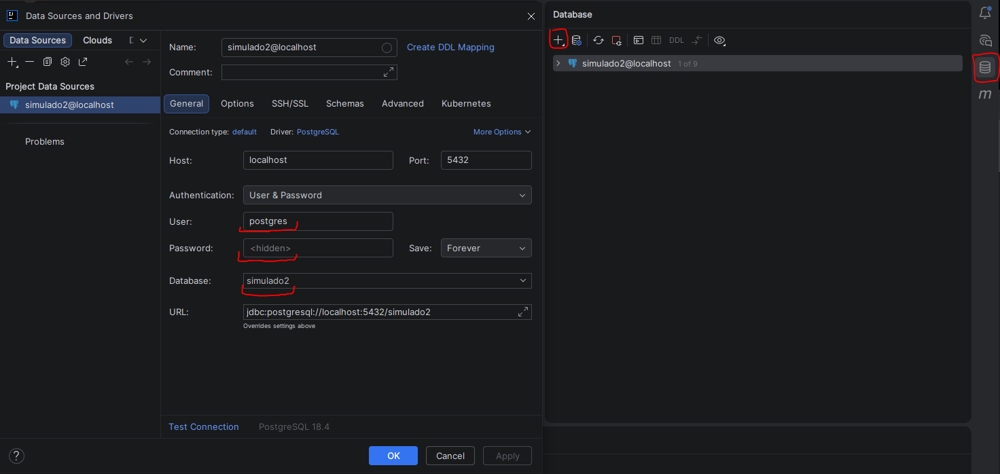

# CRUD - API REST

este é um resumo informal feito com o intuito de estudar para prova de POOWEB II 
apartir do simulado disponibilizado no moodle

## Iniciando o projeto

### Dependencias
Considerando as instruções do simulado tem que colocar as seguintes dependencias no spring initializer  
 

    Lombok   
    Flyway Migration  
    Spring Data JPA  
    PostgreSQL Driver  
    Validation  
    SpringDoc OpenAPI
    Adicionar: Spring Web  

além disso devido a versão do spring incluir também a dependencia
```xml

<dependency>
    <groupId>org.flywaydb</groupId>
    <artifactId>flyway-database-postgresql</artifactId>
</dependency>

```

### properties

para configurar o application.properties colocamos as seguintes instruções.

```properties

#Servidor
server.port=8080

#postgres
spring.datasource.url=jdbc:postgresql://localhost:5432/nome_do_banco
spring.datasource.username=postgres
spring.datasource.password=1234
spring.datasource.driver-class-name=org.postgresql.Driver

#jpa
spring.jpa.hibernate.ddl-auto=validate
spring.jpa.show-sql=true
spring.jpa.properties.hibernate.format_sql=true

#flyway
spring.flyway.enabled=true
spring.flyway.locations=classpath:db/migration
spring.flyway.baseline-on-migrate=true

#swagger
springdoc.api-docs.path=/api-docs
springdoc.swagger-ui.path=/swagger-ui.html

```

também é importante lembrar que é necessario a criação da base de dados

## migrações

no simulado pede duas migrações separadas, uma com create table e outra com insert  
as migration devem ser feitas em um arquivo .sql dentro da pasta resources/db.migrations 
iniciadas por exemplo V1__ , imporante que seja dois underlines e V maisuculo 

### V1__create_table_sala

```sql

    create table sala(

        id_sala serial primary key,
        nome varchar(50) unique not null,
        qnt_aluno int not null,
        qnt_pc int,
        ano int not null,
        area decimal(10,2) not null,
        situacao varchar(30) not null
        
    );

```

para criar um enum se coloca no banco como varchar  
primary key ja faz a coluna ser unique

### V2__insert_into_sala

```sql

    insert into sala (nome, qnt_aluno, qnt_pc, ano, area, situacao) values
        ('Bloco F sala 109', 'f109', 40, 38, 1998, 65.8, 'DISPONIVEL'),
        ('Bloco F sala 209', 'f209', 30, 32, 1998, 42.7, 'EM_REFORMA'),
        ('Bloco G sala 109', 'g109', 20, 15, 2015, 20, 'INTERDITADA');

```

aqui é necessario informar as colunas que serao populadas visto q chave primaria é auto
incrementavel

### Configurar data souce

após criado os arquivos contendo as migration é necessario configurar o data souce do intelij
esta marcado com vermelho campos e opções necessarias


## Model

## enum

para fazer uma tabela com enum deve-se criar uma classe java com o nome do campo, nesse caso Situacao.java
dentro da pasta model e dentro da classe criar o enum

```java

    public enum Situacao{
    
        DISPONIVEL,
        EM_REFORMA,
        INTERDITADA
    
    }

```
## model

### classe

para a classe usamos as seguintes anotações

```bash
    @Data
    @NoArgsConstructor
    @AllArgsConstructor
    @Entity
    @Table(name="sala") //nome da tabela no banco
    @Schema(description = "entidade que representa sala de aula") //descricao com swagger
    public class Sala{}
```

### atributos

para todos os atributos usaremos as anotações ```@Column(name="nome_coluna_no_banco")``` e ```@Schema(description="documentacao_swagger")```

iniciamos com o ID, que será do tipo long  
também sera usado a anotação ```@GeneratedValue(strategy = GenerationType.IDENTITY)``` além de ```@Id```

outras anotações que iremos usar será   

| Anotação | Descricao dela                          |
| :--- |:----------------------------------------|
```@NotBlank(message="doc_desc")``` | para strings que nao podem ser vazias
```@NonNull(message="doc_desc")``` | para numeros que nao podem ser vazios
```@Max(value=100, message="doc_desc")``` | para definir maximo  
```@Min(value=0, message="doc_desc")``` | para definir minimo  
```@Size(min=0, max=100, message="doc_desc")``` | para definir minimo e o maximo de uma string
```@DecimalMin(value=0.0, inclusive=false, message="doc_desc")``` | para definir minimo em um tipo decimal

ex:

```java

    @Id
    @GeneratedValue(strategy = GenerationType.IDENTITY)
    @Column(name = "id_sala")
    @Schema(description = "Id unico de cada sala")
    private Integer idSala;

    @NotBlank
    @Size(min = 3, max = 50, message = "Deve conter entre 3 e 50 caracteres")
    @Column(name = "nome")
    @Schema(description = "Nome da sala")
    private String nome;

```

observações:

    - size funciona para strings mas para inteiros deve usar min e max
    - para num usar o tipo enum referente ao campo
    - para enum deve se usar notnull e nao notblank
    - quando for deicmal usar value entre aspas "0.0"
    
## Repository

essa camada integra o banco de dados com a aplicação.
herdando a interface jpa ele já vem com as funções de um crud

    findAll(): Retorna uma lista (List<Sala>) com todas as salas do banco de dados.
    findById(Integer id): Busca uma sala pelo seu ID. Retorna um Optional<Sala>.
    findAllById(Iterable<Integer> ids): Busca uma lista de salas a partir de vários IDs fornecidos.
    existsById(Integer id): Retorna true se existir uma sala com aquele ID no banco e false caso contrário.
    count(): Retorna o número total de registos na tabela (long).
    
    save(Sala entity): Cria uma nova sala (se o ID for nulo) ou atualiza uma sala existente (se o ID já existir no banco). Retorna a entidade salva.
    saveAll(Iterable<Sala> entities): Salva ou atualiza uma coleção/lista de salas de uma só vez.
    saveAndFlush(Sala entity): Salva a entidade e força o envio imediato da alteração para o banco de dados.
    
    deleteById(Integer id): Remove do banco a sala associada ao ID informado.
    delete(Sala entity): Remove o objeto sala passado como argumento.
    deleteAllById(Iterable<Integer> ids): Remove todas as salas correspondentes à lista de IDs.
    deleteAll(Iterable<Sala> entities): Remove uma lista específica de objetos salas.
    deleteAll(): Apaga todos os registos da tabela sala.
    deleteAllInBatch(): Apaga todos os registos executando uma única query SQL (DELETE FROM sala), o que é muito mais rápido do que o deleteAll().
    
    findAll(Sort sort): Retorna todas as salas ordenadas por um ou mais campos.
    findAll(Pageable pageable): Retorna as salas de forma paginada (ex: buscar apenas os 10 primeiros registos da página 0).

para criar a interface repository basta colocar extends jparepository 
e passar o nome da table a eo tipo primitivo da sua chave primaria

```java
@Repository
public interface SalaRepository extends JpaRepository<Sala, Integer>{}
```
após isso adicionar os metodos que sao necessarios que nao vem por padrao jpa

## service

a camada service fica entre o repository (comunicação com banco) 
e controller (controle de requisições). nele fica armazenado o "coração" da api,
as regras de negocio

antes de inciar a classe é necessario adicionar a anotação ```@service```

```java

@Service 
public class SalaService{}

```
após isso é necessario um construtor que faça aligação com o repository

```java

private final SalaRepository salaRepository;

public SalaService(SalaRepository salaRepository) {
    this.salaRepository = salaRepository;
}

```

depois disso é necessario criar as funcoes que serão ultilizadas
exemplos


```java

public Sala salvar(Sala sala){

    return salaRepository.save(sala);

}

public List<Sala> buscarTodas(){

    return salaRepository.findAll();

}

public Sala buscarId(int id){

    return salaRepository.findById(id).orElseThrow(() -> new ResponseStatusException(
            HttpStatus.NOT_FOUND, "Id da sala nao encontrado"
    ));

}

public Sala atualizar(int id, Sala novaSala){

    Sala antigaSala = buscarId(id);

    antigaSala.setNome(novaSala.getNome());
    antigaSala.setQnt_aluno(novaSala.getQnt_aluno());
    antigaSala.setQnt_pc(novaSala.getQnt_pc());
    antigaSala.setAno(novaSala.getAno());
    antigaSala.setArea(novaSala.getArea());
    antigaSala.setSituacao(novaSala.getSituacao());

    return salaRepository.save(antigaSala);

}

public void deletar(int id){

    Sala excluirSala = buscarId(id);

    if (excluirSala.getSituacao() == Situacao.DISPONIVEL){
        throw new ResponseStatusException(HttpStatus.BAD_REQUEST, "Sala está disponivel");
    }

    salaRepository.delete(excluirSala);

}

```
aqui está um exemplo com salvar, buscar todas, buscar por id, atualizar, e excluir.
todas funcoes herdadas do jpa

vale ressaltar que o metodo deletar possui regra de negocio, 
caso nao houvesse bastaria executar a ultima linha

## controller

aqui no controller que se define os respectivos status de retorno http

    ● 200 OK: A requisição foi bem-sucedida e o servidor retornou os dados solicitados.
    ● 201 Created: A requisição foi bem-sucedida e um novo recurso foi criado no servidor (comum em requisições
    POST).
    ●204 Status No Content: para delete
    ● 400 Bad Request: O servidor não entendeu a requisição devido a uma sintaxe inválida ou dados incorretos
    enviados pelo cliente.
    ● 401 Unauthorized: A requisição exige autenticação. O usuário não está autenticado
    ● 403 Forbidden: O usuário está autenticado, mas não tem permissão (autorização) para acessar o recurso
    solicitado.
    ● 404 Not Found: O servidor não encontrou o recurso solicitado
    ● 500 Internal Server Error: O servidor encontrou uma condição inesperada que o impediu de atender à requisição
    (um erro genérico no código do servidor).
    
para identificar o controller vamos usar as seguintes anotações

```java

@RestController
@RequestMapping("/caminho")
@Tag(name = "nome", description = "endpoints") //documentação
public SalaController{}


```

assim como o service liga com o repository o controller deve conectar com o service
```java

    private SalaService salaService;

    public SalaController(SalaService salaService){

        this.salaService = salaService;

    }

```

depois disso deve ser mapeado cada endpoit, usando postmap para criar
getmap para listar, putmap atualizar e deletemap para deletar

além disso a anotação operation para documentar

cada metodo precisa retornar seu devido status corretamente

exemplo de controller:
```java

@RestController
@RequestMapping("/salas")
@Tag(name="salas", description = "endpoints para salas")
public class SalaController {

    private SalaService salaService;

    public SalaController(SalaService salaService){

        this.salaService = salaService;

    }

    @PostMapping
    @Operation(summary = "Cadastrar sala")
    public ResponseEntity<Sala> salvar(@Valid @RequestBody Sala sala) {

        Sala novaSala = salaService.salvar(sala);
        return ResponseEntity.status(HttpStatus.CREATED).body(novaSala);

    }

    @GetMapping
    @Operation(summary = "Buscar todas salas")
    public ResponseEntity<List<Sala>> buscarTodas(){

        List<Sala> salas = salaService.buscarTodas();
        return ResponseEntity.ok(salas);

    }

    @GetMapping("/{id}")
    @Operation(summary = "Buscar sala especifica por id")
    public ResponseEntity<Sala> buscarId(@PathVariable int id) {

        Sala sala = salaService.buscarId(id);
        return ResponseEntity.ok(sala);

    }

    @PutMapping("/{id}")
    @Operation(summary = "atualizar sala ja existente")
    public ResponseEntity<Sala> atualizar(@PathVariable int id, Sala novasala) {

        Sala sala = salaService.atualizar(id, novasala);
        return ResponseEntity.ok(sala);

    }

    @DeleteMapping("/{id}")
    @Operation(summary = "excluir sala")
    public ResponseEntity<Void> deletar(@PathVariable int id){

        salaService.deletar(id);
        return ResponseEntity.noContent().build();

    }

}

```

## Conlcuido

depois para acessar a documentacao basta ir em localhost:8080/caminho
e colcoar o que foi definido nas properties

exemplo:

localhost:8080/swagger-ui.html
